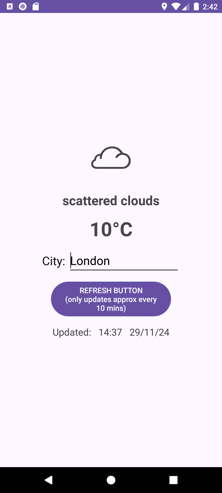

# Easy Weather Icons Font

[Download this font (it's free!)](https://github.com/boxbot6/easy-weather-icons-font/raw/main/downloads/easy_weather_icons_font.zip)

<br>

[](https://boxbot6.github.io/easy-weather-icons-font/images/easy-weather-icons-font-example-1.png)

This font is designed to be easily compatible across a large variety of uses (Apps, Windows, KWGT, OpenWeatherMap, meteo etc.) and so it has far more icons than are actually used for any single application as well as including additional day and night versions of all the icons to allow for a simple universal suffix to display a complete set of icons for each of those conditions - for use of day/night icons please see the How to guides below.  

(The above image shows just a sample of the icons that this font contains - download and open `easy_weather_icons_font_(fonts)/demo.html` in a browser or install the font on Windows and use Character Map to view the full .ttf icon set.)

It is similar in appearance to the early version of Samsung's Easy Mode Accuweather Icons and so is ideal for use when making functional or easy to understand apps or in those that replace classic or discontinued versions.  

Typically use as you would any other TrueType icon font (.ttf) (or please see details in the How to guides below) - for the separate icons you can also use the individual .svg image files included in `easy_weather_icons_font_(svg's)/SVG/`

Can be used as a direct replacement for 'meteo' icon font.

If you want to program your own App and show the current weather you will need to include the font conversion code as shown in the API Demo.apk example further below (it is also included in the download `How to use easy_weather_icons_font (includes font conversion code and lists of the icons).txt` file.

## Weather Icons Font, Free Icon Font, KWGT, KWLP, Icon Font, FontIcon, Weather Font, OpenWeatherMap, Easy Mode, Meteo, Icons, Font, TTF, JSON, SVG, Free.
## Files included:
* easy_weather_icons_font.ttf
* easy_weather_icons_font.json
* How to use easy_weather_icons_font (includes font conversion code and lists of the icons).txt
* API Demo.apk
* Folder - Android Studio Project Files for the API Demo.apk
* Folder - easy_weather_icons_font_(fonts)
* Folder - easy_weather_icons_font_(sample_images)
* Folder - easy_weather_icons_font_(svg's)

<br>

[Download .zip](https://github.com/boxbot6/easy-weather-icons-font/raw/main/downloads/easy_weather_icons_font.zip)

<br>

### Sizes:
- vector icon dimensions 32x32px

<br>

### To use:
- Download and unzip the files.
- Use the .ttf as you would any other icon font (in Windows it's best to install new fonts as administrator for 'all users' to allow them to list correctly in third party programs like Inkscape etc.).
- In Windows use Character Map to easily select and copy the icons you want and then paste them into your work.
- Don't forget to embed, link or include the font with your work when exporting it to use elsewhere.

<br>

### To edit:
- Copy 'easy_weather_icons_font.ttf' into a font editor like FontForge (free) or otherwise import the individual icons (svg's) or complete set contained within 'easy_weather_icons_font.json' into an online editor such as IcoMoon where you can edit them and/or then create your own new font.

<br>

### How to use in KWGT: (compatible where you previously used 'meteo' or other icon fonts.)
- Copy 'easy_weather_icons_font.ttf' and 'easy_weather_icons_font.json' to the folder Kustom/icons on your device.
- Choose this FontIcon/Set when adding a FontIcon or using one inside a Komponent like FontWeather (this is included free in the pre-installed Komponent Base Pack).
- (note: press the padlock symbol in the top right in the KWGT menu to unlock access to change the FontIcon/Set inside a Komponent.)

<br>

### To use the day/night icons in KWGT:
- If using: `$wi(icon)$` in the formula editor to show icons, replace it with: `$if(ai(isday)=1,wi(icon)+day,wi(icon)+night)$`
- If using: `$wi(code)$` in the formula editor to show icons, replace it with: `$if(ai(isday)=1,wi(code)+day,wi(code)+night)$`

**note:** also contains extra icons not included in the original KWGT current weather lists - if you want to display these extra icons you will need
to add additional code for each one you want to show in the formula editor.  
e.g. to show an umbrella icon instead of the rain icon use: `$if(wi(icon)=RAIN,UMBRELLA)$`

<br>

### How to use in Apps:

- In Android Studio create a new font folder: **app**/res/font and copy 'easy_weather_icons_font.ttf' to it.
- Reference the font where you want to use it in your layouts using: `android:fontFamily="@font/easy_weather_icons_font"`

<br>

### How to show the current weather icon in your app using OpenWeatherMap and Android Studio (includes using the day/night icons).
#### General overview of the method with an example below (API Demo).

- Get the current weather data by making an API call (basically a request for information) to openweathermap by sending your request combined with a free key.  
(How to make an API call instructions at <https://openweathermap.org/current> or see example below - open a free openweathermap account to get your own free API key.)

- Use the response from openweathermap to populate some new variables: sunrise, sunset, updatedAt and description etc.
(The example-code below uses the 'description' part of the response from openweathermap rather than 'main' or 'icon' because it contains the
largest range of weather conditions.)

- Use sunrise, sunset and updatedAt to create a useable night-time indicator tag (nightTag) to use in conjunction with the description.

- Use 'description' and 'nightTag' in the font conversion code 'convert openweathermap descriptions to easy_weather_icons_font' (given in the MainActivity example-code below) to display the corresponding icon from the font.

<br>

### API Demo.apk {#API-Demo}

(A simple demo app that uses 'easy_weather_icons_font' with the OpenWeatherMap API is included in the download for you to try and experiment with (for those interested in the coding it was constructed as shown in the example-code shown here beneath it). Otherwise you can just install the app and try it out.  

<br>

[](https://boxbot6.github.io/easy-weather-icons-font/images/api-demo-screenshot-example-1.png)

<br>

The code has been updated to Kotlin.

### //example-code//

- Use **Android Studio** to create a new project named 'API Demo' using the template for Empty Views Activity.

- Right click the **app**/res folder and create a New > Folder > Font Folder there and then copy easy_weather_icons_font.ttf to it.

(note: creating this font folder can sometimes be troublesome depending on what version of Android Stuio you are using - if this happens you can try opening **app**/res/layout/activity_main.xml and in any TextView adding `android:fontFamily="@font/any_font_name_here" and then hovering over the missing font resource and then select 'create font resource file' from the popup menu to force the automatic creation the new font folder to contain the new .xml resource inside it - you can then delete the temporary 'any_font_name_here.xml' resource file and add your own fonts to the font folder.

(also note: font names in this folder can only consist of lowercase letters a to z, numbers 0 to 9, or underscores, so if using any fonts that dont comply with this you can just rename them to match this format).

- Copy code below to AndroidManifest.xml.

```
<?xml version="1.0" encoding="utf-8"?>
<manifest xmlns:android="http://schemas.android.com/apk/res/android"
    xmlns:tools="http://schemas.android.com/tools">

    <uses-permission android:name="android.permission.INTERNET" />

    <application
        android:allowBackup="true"
        android:dataExtractionRules="@xml/data_extraction_rules"
        android:fullBackupContent="@xml/backup_rules"
        android:icon="@mipmap/ic_launcher"
        android:label="API Demo"
        android:roundIcon="@mipmap/ic_launcher_round"
        android:supportsRtl="true"
        android:theme="@style/Theme.APIDemo"
        tools:targetApi="31">
        <activity
            android:name=".MainActivity"
            android:exported="true">
            <intent-filter>
                <action android:name="android.intent.action.MAIN" />

                <category android:name="android.intent.category.LAUNCHER" />
            </intent-filter>
        </activity>
    </application>

</manifest>
 ```
- Copy code below to kotlin MainActivity. (this part includes the raw code to 'convert openweathermap descriptions to easy_weather_icons_font' - if you are writing your own app you can incorporate just this font conversion list into your own code.)

```
package com.example.apidemo

import android.os.Bundle
import android.os.Handler
import android.os.Looper
import android.text.Editable
import android.text.Layout
import android.text.Spannable
import android.text.SpannableString
import android.text.SpannableStringBuilder
import android.text.TextUtils
import android.text.style.AlignmentSpan
import android.view.KeyEvent
import android.view.View
import android.view.inputmethod.InputMethodManager
import android.widget.Button
import android.widget.EditText
import android.widget.TextView
import android.widget.Toast
import androidx.appcompat.app.AppCompatActivity
import org.json.JSONException
import org.json.JSONObject
import java.text.SimpleDateFormat
import java.util.Locale
import java.util.concurrent.Executors


class MainActivity : AppCompatActivity() {
    private val myExecutor = Executors.newSingleThreadExecutor()
    private val myHandler = Handler(Looper.getMainLooper())

    // create values
    // api key (put your openweathermap key here)
    private var apiKey: String? = "73cbebdd0322acd49bda6ede059b2b18"

    // use this code for user city input (also use the api call for city with myExecutor in apiWeatherCall() further below)
    private var cityUserInput: String? = "London"
    private var city: EditText? = null

    // use this code for latitude and longitude (also use the api call for latitude and longitude with myExecutor in apiWeatherCall() further below)
    // this is just a fixed location London example, add extra code to find your location and you can use your actual current GPS position here
    //    private var latitude = 51.507351
    //    private var longitude = -0.127758


    override fun onCreate(savedInstanceState: Bundle?) {
        super.onCreate(savedInstanceState)
        setContentView(R.layout.activity_main)

        apiWeatherCall() // calls the default city "London" to populate app prior to any user input

        city = findViewById(R.id.inputEditTextForCity)
        city?.setText(cityUserInput.toString())


        // soft keyboard listener
        // on pressing the enter key.
        city?.setOnKeyListener { _, keyCode, event ->
            // if the event is a key-down event on the "enter" button
            if (event.action == KeyEvent.ACTION_DOWN && keyCode == KeyEvent.KEYCODE_ENTER) {
                // Perform action on key press
                 cityUserInput = city?.text.toString()
                if (TextUtils.isEmpty(cityUserInput)) {
                    Toast.makeText(this,"Oops, Try entering a different location?", Toast.LENGTH_SHORT).show()
                }

                apiWeatherCall() // gets the weather from an api call to openweathermap

                true
            } else {
                false
            }
        }

        // button
        val refreshButton = findViewById<View>(R.id.button) as Button
        refreshButton.setOnClickListener {

            cityUserInput = city?.text.toString()
            if (TextUtils.isEmpty(cityUserInput)) {
                Toast.makeText(this,"Oops, Try entering a different location?", Toast.LENGTH_SHORT).show()
            }

            // close soft keyboard if open when button pressed
            val imm = this.getSystemService(INPUT_METHOD_SERVICE) as InputMethodManager
            //Find the currently focused view, so we can grab the correct window token from it.
            var view = this.currentFocus
            //If no view currently has focus, create a new one, just so we can grab a window token from it
            if (view == null) {
                view = View(this)
            }
            imm.hideSoftInputFromWindow(view.windowToken, 0)

        apiWeatherCall() // gets the weather from an api call to openweathermap

        Toast.makeText(this, "Refresh Button Pressed", Toast.LENGTH_SHORT).show()
        }
    }

    private fun apiWeatherCall() {

        myExecutor.execute {
            // use this if using city user input
            val result = HttpRequest.executeGet("https://api.openweathermap.org/data/2.5/weather?q=$cityUserInput&units=metric&appid=$apiKey").toString() // userCity

            // use this if using latitude and longitude
            // val result = HttpRequest.executeGet("https://api.openweathermap.org/data/2.5/weather?lat=$latitude&lon=$longitude&units=metric&appid=$apiKey").toString()

            myHandler.post {

                try {
                    // create JSON objects from the API response
                    val jsonObj = JSONObject(result)
                    val main = jsonObj.getJSONObject("main")
                    val sys = jsonObj.getJSONObject("sys")
                    val weather = jsonObj.getJSONArray("weather").getJSONObject(0)

                    // create variables using strings and data from the JSON object
                    var location = jsonObj.getString("name") // + ", " + sys.getString("country");
                    val temperature = String.format("%.0f", main.getDouble("temp")) + "°C"
                    var description = weather.getString("description") // String icon = weather.getString("main");
                    val sunrise = sys.getLong("sunrise")
                    val sunset = sys.getLong("sunset")
                    val updatedAt = jsonObj.getLong("dt")
                    val updatedAtFormatted = "Updated:   " + SimpleDateFormat("HH:mm   dd/MM/yy", Locale.ENGLISH).format(updatedAt * 1000)

                    // use sunrise, sunset and updatedAt variables above to create a tag for night time:
                    val nightTag: Boolean = updatedAt !in sunrise..<sunset

                    if ("Globe".equals(location, ignoreCase = true)) {
                        location = "Not Available"
                        description = "Not Available"
                    }
                    if ("Greater London".equals(location, ignoreCase = true)) {
                        location = "London" // here just to shorten this response
                    }


                    // convert openweathermap descriptions to easy_weather_icons_font
                    // (feel free to use this font conversion list in your own app when using easy_weather_icons_font.)
                    var icon = "\uE900" // creates icon string and sets default icon to: (N/A)

                    if (description == "") { icon = "\uE900" } // sets empty icon to: (N/A)
                    if (description == null) { icon = "\uE900" } // sets null icon to: (N/A) keep this just in case input is ever redefined as null
                    if (description == "clear sky") { icon = "\uE96D" } // CLEARday
                    if (description == "clear sky" && nightTag) { icon = "\uE96E" } // CLEARnight
                    if (description == "few clouds") { icon = "\uE967" } // PARTLY_CLOUDYday (few clouds: 11-25%)
                    if (description == "few clouds" && nightTag) { icon = "\uE968" } // PARTLY_CLOUDYnight (few clouds: 11-25%)
                    if (description == "scattered clouds") { icon = "\uE9D3" } // CLOUD2day (scattered clouds: 25-50%)
                    if (description == "scattered clouds" && nightTag) { icon = "\uE9D4" } // CLOUD2night (scattered clouds: 25-50%)
                    if (description == "broken clouds") { icon = "\uE9DF" } // CLOUDY2day (broken clouds: 51-84%)
                    if (description == "broken clouds" && nightTag) { icon = "\uE9E0" } // CLOUDY2night (broken clouds: 51-84%)
                    if (description == "overcast clouds") { icon = "\uE961" } // MOSTLY_CLOUDYday (overcast clouds: 85-100%)
                    if (description == "overcast clouds" && nightTag) { icon = "\uE962" } // MOSTLY_CLOUDYnight (overcast clouds: 85-100%)
                    if (description == "shower rain") { icon = "\uE928" } // SHOWERSday
                    if (description == "shower rain" && nightTag) { icon = "\uE929" } // SHOWERSnight
                    if (description == "rain") { icon = "\uE92E" } // RAINday
                    if (description == "rain" && nightTag) { icon = "\uE932" } // RAINnight
                    if (description == "thunderstorm") { icon = "\uE910" } // THUNDERSTORMSday
                    if (description == "thunderstorm" && nightTag) { icon = "\uE911" } // THUNDERSTORMSnight
                    if (description == "snow") { icon = "\uE940" } // SNOWday
                    if (description == "snow" && nightTag) { icon = "\uE941" } // SNOWnight
                    if (description == "mist") { icon = "\uEA42" } // mistday
                    if (description == "mist" && nightTag) { icon = "\uEA43" } // mistnight
                    if (description == "thunderstorm with light rain") {icon = "\uEA60" } // thunderstorm_with_light_rainday
                    if (description == "thunderstorm with light rain" && nightTag) { icon = "\uEA61" } // thunderstorm_with_light_rainnight
                    if (description == "thunderstorm with rain") { icon = "\uEA63" } // thunderstorm_with_rainday
                    if (description == "thunderstorm with rain" && nightTag) { icon = "\uEA64" } // thunderstorm_with_rainnight
                    if (description == "thunderstorm with heavy rain") { icon = "\uEA66" } // thunderstorm_with_heavy_rainday
                    if (description == "thunderstorm with heavy rain" && nightTag) { icon = "\uEA67" } // thunderstorm_with_heavy_rainnight
                    if (description == "light thunderstorm") { icon = "\uE910" } // THUNDERSTORMSday
                    if (description == "light thunderstorm" && nightTag) { icon = "\uE911" } // THUNDERSTORMSnight
                    if (description == "heavy thunderstorm") { icon = "\uE90D" } // SEVERE_THUNDERSTORMSday
                    if (description == "heavy thunderstorm" && nightTag) { icon = "\uE90E" } // SEVERE_THUNDERSTORMSnight
                    if (description == "ragged thunderstorm") { icon = "\uEA69" } // ragged_thunderstormday
                    if (description == "ragged thunderstorm" && nightTag) { icon = "\uEA6A" } // ragged_thunderstormnight
                    if (description == "thunderstorm with light drizzle") { icon = "\uE982" } // THUNDERSHOWERSday
                    if (description == "thunderstorm with light drizzle" && nightTag) { icon = "\uE983" } // THUNDERSHOWERSnight
                    if (description == "thunderstorm with drizzle") { icon = "\uEA6C" } // thunderstorm_with_drizzleday
                    if (description == "thunderstorm with drizzle" && nightTag) { icon = "\uEA6D" } // thunderstorm_with_drizzlenight
                    if (description == "thunderstorm with heavy drizzle") { icon = "\uE982" } // THUNDERSHOWERSday
                    if (description == "thunderstorm with heavy drizzle" && nightTag) { icon = "\uE983" } // THUNDERSHOWERSnight
                    if (description == "light intensity drizzle") { icon = "\uE922" } // DRIZZLEday
                    if (description == "light intensity drizzle" && nightTag) { icon = "\uE923" } // DRIZZLEnight
                    if (description == "drizzle") { icon = "\uE922" } // DRIZZLEday
                    if (description == "drizzle" && nightTag) { icon = "\uE923" } // DRIZZLEnight
                    if (description == "heavy intensity drizzle") { icon = "\uE922" } // DRIZZLEday
                    if (description == "heavy intensity drizzle" && nightTag) { icon = "\uE923" } // DRIZZLEnight
                    if (description == "light intensity drizzle rain") { icon = "\uE922" } // DRIZZLEday
                    if (description == "light intensity drizzle rain" && nightTag) { icon = "\uEA70" } // DRIZZLEnight
                    if (description == "drizzle rain") { icon = "\uEA6F" } // drizzle_rainday
                    if (description == "drizzle rain" && nightTag) { icon = "\uEA01" } // drizzle_rainnight
                    if (description == "heavy intensity drizzle rain") { icon = "\uEA00" } // RAINYday
                    if (description == "heavy intensity drizzle rain" && nightTag) { icon = "\uEA01" } // RAINYnight
                    if (description == "shower rain and drizzle") { icon = "\uE928" } // SHOWERSday
                    if (description == "shower rain and drizzle" && nightTag) { icon = "\uE929" } // SHOWERSnight
                    if (description == "heavy shower rain and drizzle") { icon = "\uE931" } // HEAVY_SHOWERSday
                    if (description == "heavy shower rain and drizzle" && nightTag) { icon = "\uE932" } // HEAVY_SHOWERSnight
                    if (description == "shower drizzle") { icon = "\uE928" } // SHOWERSday
                    if (description == "shower drizzle" && nightTag) { icon = "\uE929" } // SHOWERSnight
                    if (description == "light rain") { icon = "\uEA00" } // RAINYday
                    if (description == "light rain" && nightTag) { icon = "\uEA01" } // RAINYnight
                    if (description == "moderate rain") { icon = "\uE92E" } // RAINday
                    if (description == "moderate rain" && nightTag) { icon = "\uE932" } // RAINnight
                    if (description == "heavy intensity rain") { icon = "\uE92E" } // RAINday
                    if (description == "heavy intensity rain" && nightTag) { icon = "\uE932" } // RAINnight
                    if (description == "very heavy rain") { icon = "\uEA03" } // RAINY2day
                    if (description == "very heavy rain" && nightTag) { icon = "\uEA04" } // RAINY2night
                    if (description == "extreme rain") { icon = "\uEA03" } // RAINY2day
                    if (description == "extreme rain" && nightTag) { icon = "\uEA04" } // RAINY2night
                    if (description == "freezing rain") { icon = "\uE925" } // FREEZING_RAINday
                    if (description == "freezing rain" && nightTag) { icon = "\uE926" } // FREEZING_RAINnight
                    if (description == "light intensity shower rain") { icon = "\uE928" } // SHOWERSday
                    if (description == "light intensity shower rain" && nightTag) { icon = "\uE929" } // SHOWERSnight
                    if (description == "heavy intensity shower rain") { icon = "\uE931" } // HEAVY_SHOWERSday
                    if (description == "heavy intensity shower rain" && nightTag) { icon = "\uE932" } // HEAVY_SHOWERSnight
                    if (description == "ragged shower rain") { icon = "\uE928"  } // SHOWERSday
                    if (description == "ragged shower rain" && nightTag) { icon = "\uE929" } // SHOWERSnight
                    if (description == "light snow") { icon = "\uE937" } // LIGHT_SNOW_SHOWERSday
                    if (description == "light snow" && nightTag) { icon = "\uE938" } // LIGHT_SNOW_SHOWERSnight
                    if (description == "heavy snow") { icon = "\uE97C" } // HEAVY_SNOWday
                    if (description == "heavy snow" && nightTag) { icon = "\uE97D" } // HEAVY_SNOWnight
                    if (description == "sleet") { icon = "\uE946" } // SLEETday
                    if (description == "sleet" && nightTag) { icon = "\uE947" } // SLEETnight
                    if (description == "light shower sleet") { icon = "\uE919" } // MIXED_RAIN_SLEETday
                    if (description == "light shower sleet" && nightTag) { icon = "\uE91A" } // MIXED_RAIN_SLEETnight
                    if (description == "shower sleet") { icon = "\uE919" } // MIXED_RAIN_SLEETday
                    if (description == "shower sleet" && nightTag) { icon = "\uE91A" } // MIXED_RAIN_SLEETnight
                    if (description == "light rain and snow") { icon = "\uE916" } // MIXED_RAIN_SNOWday
                    if (description == "light rain and snow" && nightTag) { icon = "\uE917" } // MIXED_RAIN_SNOWnight
                    if (description == "rain and snow") { icon = "\uE916" } // MIXED_RAIN_SNOWday
                    if (description == "rain and snow" && nightTag) { icon = "\uE917" } // MIXED_RAIN_SNOWnight
                    if (description == "light shower snow") { icon = "\uE97F" } // SCATTERED_SNOW_SHOWERSday
                    if (description == "light shower snow" && nightTag) { icon = "\uE980" } // SCATTERED_SNOW_SHOWERSnight
                    if (description == "shower snow") { icon = "\uE988" } // SNOW_SHOWERSday
                    if (description == "shower snow" && nightTag) { icon = "\uE989" } // SNOW_SHOWERSnight
                    if (description == "heavy shower snow") { icon = "\uE97C" } // HEAVY_SNOWday
                    if (description == "heavy shower snow" && nightTag) { icon = "\uE97D" } // HEAVY_SNOWnight
                    if (description == "smoke") { icon = "\uEA45" } // smokeday
                    if (description == "smoke" && nightTag) { icon = "\uEA46" } // smokenight
                    if (description == "haze") { icon = "\uE952" } // HAZEday
                    if (description == "haze" && nightTag) { icon = "\uE953" } // HAZEnight
                    if (description == "sand/ dust whirls") { icon = "\uEA4B" } // sand/_dust_whirlsday
                    if (description == "sand/ dust whirls" && nightTag) { icon = "\uEA4C" } // sand/_dust_whirlsnight
                    if (description == "fog") { icon = "\uE94F" } // FOGday
                    if (description == "fog" && nightTag) { icon = "\uE950" } // FOGnight
                    if (description == "sand") { icon = "\uEA51" } // sandday
                    if (description == "sand" && nightTag) { icon = "\uEA52" } // sandnight
                    if (description == "dust") { icon = "\uEA51" } // DUSTday
                    if (description == "dust" && nightTag) { icon = "\uE94A" } // DUSTnight
                    if (description == "volcanic ash") { icon = "\uEA57" } // volcanic_ashday
                    if (description == "volcanic ash" && nightTag) { icon = "\uEA58" } // volcanic_ashnight
                    if (description == "squalls") { icon = "\uEA5A" } // squallsday
                    if (description == "squalls" && nightTag) { icon = "\uEA5B" } // squallsnight
                    if (description == "tornado") { icon = "\uE904" } // TORNADOday
                    if (description == "tornado" && nightTag) { icon = "\uE905" } // TORNADOnight


                    // set layout id's
                    val iconText: TextView = findViewById(R.id.displayWeatherIconText)
                    val descriptionText: TextView = findViewById(R.id.displayDescriptionText)
                    val temperatureText: TextView = findViewById(R.id.displayTemperatureText)
                    val editLocationText: EditText = findViewById(R.id.inputEditTextForCity)
                    val enterLocation: Editable = SpannableStringBuilder(location) // Pass a string here
                    val updatedAtText: TextView = findViewById(R.id.displayUpdatedAtText)

                    // show values
                    iconText.text = icon
                    descriptionText.text = description
                    temperatureText.text = temperature
                    editLocationText.text = enterLocation
                    updatedAtText.text = updatedAtFormatted

                } catch (e: JSONException) {
                    val text = "Oops, unable to get data from Openweathermap!"
                    val centeredText: Spannable = SpannableString(text)
                    centeredText.setSpan(
                        AlignmentSpan.Standard(Layout.Alignment.ALIGN_CENTER),
                        0, text.length - 1,
                        Spannable.SPAN_INCLUSIVE_INCLUSIVE
                    )

                    Toast.makeText(this@MainActivity, centeredText, Toast.LENGTH_LONG).show()
                }
            }
        }
    }
}
```
- Copy layout code below to activity_main.xml.

```
<?xml version="1.0" encoding="utf-8"?>
<LinearLayout xmlns:android="http://schemas.android.com/apk/res/android"
    xmlns:tools="http://schemas.android.com/tools"
    android:layout_width="match_parent"
    android:layout_height="match_parent"
    android:gravity="center"
    android:orientation="vertical"
    tools:context=".MainActivity">

    <TextView
        android:id="@+id/displayWeatherIconText"
        android:layout_width="match_parent"
        android:layout_height="wrap_content"
        android:layout_marginTop="0dp"
        android:layout_marginBottom="0dp"
        android:fontFamily="@font/easy_weather_icons_font"
        android:gravity="center"
        android:hint="Icon"
        android:textSize="80sp"
        tools:ignore="TextContrastCheck" />

    <TextView
        android:id="@+id/displayDescriptionText"
        android:layout_width="match_parent"
        android:layout_height="wrap_content"
        android:layout_marginTop="15dp"
        android:gravity="center"
        android:hint="Description"
        android:textSize="24sp"
        android:textStyle="bold"
        tools:ignore="TextContrastCheck" />

    <TextView
        android:id="@+id/displayTemperatureText"
        android:layout_width="match_parent"
        android:layout_height="wrap_content"
        android:layout_marginTop="12dp"
        android:layout_marginBottom="0dp"
        android:gravity="center"
        android:hint="Temp"
        android:textSize="36sp"
        android:textStyle="bold"
        tools:ignore="TextContrastCheck" />

    <LinearLayout
        android:id="@+id/linearLayoutForTextInput"
        android:layout_width="match_parent"
        android:layout_height="wrap_content"
        android:orientation="horizontal"
        android:gravity="center"
        android:layout_marginTop="10dp"
        android:layout_marginBottom="0dp"
        android:minHeight="50dp">

        <TextView
            android:id="@+id/textPrefixDialog"
            android:layout_width="wrap_content"
            android:layout_height="wrap_content"
            android:text="City: "
            android:textColor="#191919"
            android:textSize="22sp" />

        <EditText
            android:id="@+id/inputEditTextForCity"
            android:layout_width="wrap_content"
            android:layout_height="wrap_content"
            android:autofillHints="Intent"
            android:ems="8"
            android:textSize="22sp"
            android:hint="Enter a city..."
            android:inputType="text"
            android:imeOptions="actionSearch"
            android:focusable="true"
            android:textColor="#000000"
            tools:ignore="TouchTargetSizeCheck,TextContrastCheck"
            tools:targetApi="o" />

    </LinearLayout>

    <Button
        android:id="@+id/button"
        android:layout_width="wrap_content"
        android:layout_height="wrap_content"
        android:layout_centerInParent="true"
        android:layout_marginTop="10dp"
        android:minHeight="60dp"
        android:text="REFRESH BUTTON\n(only updates approx every\n10 mins)"
        tools:ignore="HardcodedText,TextSizeCheck" />

    <TextView
        android:id="@+id/displayUpdatedAtText"
        android:layout_width="match_parent"
        android:layout_height="wrap_content"
        android:layout_marginTop="10dp"
        android:layout_marginBottom="0dp"
        android:gravity="center"
        android:hint="Updated at"
        android:minHeight="30dp"
        android:textSize="18sp"
        tools:ignore="TextContrastCheck" />

</LinearLayout>
```

- Create a new kotlin class alongside MainActivity called HttpRequest and copy the code below to it.

```
package com.example.apidemo

import java.io.BufferedReader
import java.io.InputStream
import java.io.InputStreamReader
import java.net.HttpURLConnection
import java.net.URL


object HttpRequest {

    @JvmStatic
    fun executeGet(targetURL: String?): String? {
        val url: URL
        var connection: HttpURLConnection? = null
        return try {
            url = URL(targetURL)
            connection = url.openConnection() as HttpURLConnection
            connection.requestMethod = "GET"
            val `is`: InputStream

            //retrieve data from url
            val status = connection.responseCode
            `is` =
                if (status != HttpURLConnection.HTTP_OK) connection.errorStream else connection.inputStream
            val rd = BufferedReader(InputStreamReader(`is`))
            var line: String?
            val response = StringBuffer()
            while (rd.readLine().also { line = it } != null) {
                response.append(line)
                response.append('\r')
            }
            rd.close()
            response.toString()
        } catch (e: Exception) {
            e.printStackTrace()
            null
        } finally {
            connection?.disconnect()
        }
    }

}
```

- Build the .apk and test.

- If it doesn't work? - as usual with Android Studio make sure all the internal element of the version you are using (inc. Gradle JDK version and its location) are at the minimum compatible levels with the code you want to use and then try to troubleshoot any compiling and build errors one at a time using online answers from StackOverflow etc.

- If the API call doesn't work? - make sure you have put your own valid API_key in java MainActivity/class APIWeatherCall and have internet permission and access.

- Build the APK and test.

<br>

___

## Reference list of the easy_weather_icons_font names:

UNKNOWN  
TORNADO  
TROPICAL_STORM  
HURRICANE  
SEVERE_THUNDERSTORMS  
THUNDERSTORMS  
TSTORM  
MIXED_RAIN_SNOW  
MIXED_RAIN_SLEET  
MIXED_SNOW_SLEET  
FREEZING_DRIZZLE  
DRIZZLE  
FREEZING_RAIN  
SHOWERS  
SHOWER  
RAIN  
HEAVY_SHOWERS  
SNOW_FLURRIES  
LIGHT_SNOW_SHOWERS  
LSNOW  
BLOWING_SNOW  
SNOW  
HAIL  
SLEET  
DUST  
FOGGY  
FOG  
HAZE  
SMOKY  
BLUSTERY  
WINDY  
CLOUDY  
MOSTLY_CLOUDY  
MCLOUDY  
PARTLY_CLOUDY  
PCLOUDY  
CLEAR  
FAIR  
MIXED_RAIN_AND_HAIL  
ISOLATED_THUNDERSTORMS  
SCATTERED_SHOWERS  
HEAVY_SNOW  
SCATTERED_SNOW_SHOWERS  
THUNDERSHOWERS  
TSHOWER  
SNOW_SHOWERS  
ISOLATED_THUNDERSHOWERS  
NOT_AVAILABLE  
THERMOMETER  
CENTIGRADE  
FAHRENHEIT  
UV_LEVEL  
SUNRISE  
SUNRISE2  
SUNSET2  
ECLIPSE  
SNOWFLAKE  
UMBRELLA  
RAINBOW  
FOGCLOUD  
WINDY_DRIZZLE  
WINDY_CLOUDY  
sun  
sun2  
sun3  
sunrise2  
moon  
moon2  
moonstars  
cloud  
cloud2  
cloud3  
cloud4  
cloud5  
cloudy2  
cloudy3  
cloudy4  
lightning  
lightning2  
lightning3  
lightning4  
lightning5  
lightning39  
rainy  
rainy2  
rainy3  
rainy4  
raindrop  
wind  
windy  
windy2  
windy3  
windy4  
windy5  
snowy  
snowy2  
snowy3  
snowy4  
snowy5  
snow263  
snowshower  
snowshower2  
snowflake  
thermometer2  
celsius  
sunglasses  
umbrella2  
compass  
none  
mist  
smoke  
haze2  
sand_dust_whirls  
fog2  
sand  
dust2  
ash  
squall  
tornado2  
thunderstorm_with_light_rain  
thunderstorm_with_rain  
thunderstorm_with_heavy_rain  
ragged_thunderstorm  
thunderstorm_with_drizzle  
drizzle_rain  

Also contains day and night versions of each of the icons in the above list, e.g.  

FOGGY  
FOGGYday  
FOGGYnight

(To show differing day and night icons without having to code for each one individually all the other icons also needed to have day and night versions added so that a simple universal suffix can be used to display a complete set of icons for each condition - for use of day/night icons please see the How to guides above).    

This font is designed to be easily compatible across a number of uses (Apps, Windows, KWGT, OpenWeatherMap, meteo etc.) and so it has far more icons than are actually used for any single application - for a specific use you could heavily edit it or just copy only the icons that you want to use.

<br>

[](https://boxbot6.github.io/easy-weather-icons-font/images/easy-weather-icons-font-example-3.png)

___

See below for references of the components used:

<br>

### KWGT Current weather icon list (15) - to display use `$wi(icon)$` in Formula Editor

UNKNOWN  
TORNADO*  
TSTORM  
TSHOWER  
SHOWER  
RAIN  
SLEET*  
LSNOW  
SNOW*  
HAIL*  
FOG  
WINDY*  
PCLOUDY  
MCLOUDY  
CLEAR*  

(duplicated in current weather code list)*

<br>

### KWGT Current weather code list (39) - to display use `$wi(code)$` in Formula Editor

TORNADO*  
TROPICAL_STORM  
HURRICANE  
SEVERE_THUNDERSTORMS  
THUNDERSTORMS  
MIXED_RAIN_SNOW  
MIXED_RAIN_SLEET  
MIXED_SNOW_SLEET  
FREEZING_DRIZZLE  
DRIZZLE  
FREEZING_RAIN  
SHOWERS  
HEAVY_SHOWERS  
SNOW_FLURRIES  
LIGHT_SNOW_SHOWERS  
BLOWING_SNOW  
SNOW*  
HAIL*  
SLEET*  
DUST  
FOGGY  
HAZE  
SMOKY  
BLUSTERY  
WINDY*  
CLOUDY  
MOSTLY_CLOUDY  
PARTLY_CLOUDY  
CLEAR*  
FAIR  
MIXED_RAIN_AND_HAIL  
ISOLATED_THUNDERSTORMS  
SCATTERED_SHOWERS  
HEAVY_SNOW  
SCATTERED_SNOW_SHOWERS  
THUNDERSHOWERS  
SNOW_SHOWERS  
ISOLATED_THUNDERSHOWERS  
NOT_AVAILABLE 

(duplicated in current weather icon list)*

<br>

### KWGT Current weather code & icon lists combined (without duplicates)  - plus a few extra icons** (62)

UNKNOWN  
TORNADO  
TROPICAL_STORM  
HURRICANE  
SEVERE_THUNDERSTORMS  
THUNDERSTORMS  
TSTORM  
MIXED_RAIN_SNOW  
MIXED_RAIN_SLEET  
MIXED_SNOW_SLEET  
FREEZING_DRIZZLE  
DRIZZLE  
FREEZING_RAIN  
SHOWERS  
SHOWER  
RAIN  
HEAVY_SHOWERS  
SNOW_FLURRIES  
LIGHT_SNOW_SHOWERS  
LSNOW  
BLOWING_SNOW  
SNOW  
HAIL  
SLEET  
DUST  
FOGGY  
FOG  
HAZE  
SMOKY  
BLUSTERY  
WINDY  
CLOUDY  
MOSTLY_CLOUDY  
MCLOUDY  
PARTLY_CLOUDY  
PCLOUDY  
CLEAR  
FAIR  
MIXED_RAIN_AND_HAIL  
ISOLATED_THUNDERSTORMS  
SCATTERED_SHOWERS  
HEAVY_SNOW  
SCATTERED_SNOW_SHOWERS  
THUNDERSHOWERS  
TSHOWER  
SNOW_SHOWERS  
ISOLATED_THUNDERSHOWERS  
NOT_AVAILABLE  
THERMOMETER**  
CENTIGRADE**  
FAHRENHEIT**  
UV_LEVEL**  
SUNRISE**  
SUNRISE2**  
SUNSET2**  
ECLIPSE**  
SNOWFLAKE**  
UMBRELLA**  
RAINBOW**  
FOGCLOUD**  
WINDY_DRIZZLE**  
WINDY_CLOUDY**  

(extra icons)** - these are not included in the original KWGT Current weather lists so you will need to define when to use each "NAME" in your formula editor code if you wish to show them.  
e.g. to show an umbrella icon instead of the rain icon use: `$if(wi(icon)=RAIN,UMBRELLA)$`

<br>

### \*\*\*Now updated with 'meteo' icon names for compatibility where you previously used the meteo icon font\*\*\*

sun  
sun2  
sun3  
sunrise2  
moon  
moon2  
moonstars  
cloud  
cloud2  
cloud3  
cloud4  
cloud5  
cloudy2  
cloudy3  
cloudy4  
lightning  
lightning2  
lightning3  
lightning4  
lightning5  
lightning39  
rainy  
rainy2  
rainy3  
rainy4  
raindrop  
wind  
windy  
windy2  
windy3  
windy4  
windy5  
snowy  
snowy2  
snowy3  
snowy4  
snowy5  
snow263  
snowshower  
snowshower2  
snowflake  
thermometer2  
celsius  
sunglasses  
umbrella2  
compass  
none  

<br>

### \*\*\*\*Now also updated with some OpenWeatherMap 'Descriptions' below for compatibility with OpenWeatherMap API\*\*\*\* 
(The remaining OpenWeatherMap icons that are not included here are substituted by the app conversion code for similar icons already included in the font.)

mist  
smoke  
haze2  
sand_dust_whirls  
fog2  
sand  
dust2  
ash  
squall  
tornado2  
thunderstorm_with_light_rain  
thunderstorm_with_rain  
thunderstorm_with_heavy_rain  
ragged_thunderstorm  
thunderstorm_with_drizzle  
drizzle_rain  

<br>

### \*\*\*\*\*OpenWeatherMap references\*\*\*\*\*

See https://openweathermap.org/weather-conditions for details of the OpenWeatherMap icons.

<br>

OpenWeatherMap Icon list:

```
Day icon	Night icon	Description  
01d.png 	01n.png 	clear sky  
02d.png 	02n.png 	few clouds  
03d.png 	03n.png 	scattered clouds  
04d.png 	04n.png 	broken clouds  
09d.png 	09n.png 	shower rain  
10d.png 	10n.png 	rain  
11d.png 	11n.png 	thunderstorm  
13d.png 	13n.png 	snow  
50d.png 	50n.png 	mist  
```

Weather condition codes:

```
Group 2xx: Thunderstorm
ID	Main	        Description	                 Icon
200	Thunderstorm	thunderstorm with light rain	 11d
201	Thunderstorm	thunderstorm with rain  	 11d
202	Thunderstorm	thunderstorm with heavy rain	 11d
210	Thunderstorm	light thunderstorm       	 11d
211	Thunderstorm	thunderstorm	                 11d
212	Thunderstorm	heavy thunderstorm		 11d
221	Thunderstorm	ragged thunderstorm		 11d
230	Thunderstorm	thunderstorm with light drizzle	 11d
231	Thunderstorm	thunderstorm with drizzle	 11d
232	Thunderstorm	thunderstorm with heavy drizzle	 11d
```

```
Group 3xx: Drizzle
ID	Main	Description			 Icon
300	Drizzle	light intensity drizzle		 09d
301	Drizzle	drizzle				 09d
302	Drizzle	heavy intensity drizzle		 09d
310	Drizzle	light intensity drizzle rain	 09d
311	Drizzle	drizzle rain			 09d
312	Drizzle	heavy intensity drizzle rain	 09d
313	Drizzle	shower rain and drizzle		 09d
314	Drizzle	heavy shower rain and drizzle	 09d
321	Drizzle	shower drizzle			 09d
```

```
Group 5xx: Rain
ID	Main	Description	     		 Icon
500	Rain	light rain			 10d
501	Rain	moderate rain			 10d
502	Rain	heavy intensity rain		 10d
503	Rain	very heavy rain			 10d
504	Rain	extreme rain			 10d
511	Rain	freezing rain			 13d
520	Rain	light intensity shower rain	 09d
521	Rain	shower rain			 09d
522	Rain	heavy intensity shower rain	 09d
531	Rain	ragged shower rain		 09d
```

```
Group 6xx: Snow
ID	Main	Description	 	 Icon
600	Snow	light snow		 13d
601	Snow	Snow			 13d
602	Snow	Heavy snow		 13d
611	Snow	Sleet			 13d
612	Snow	Light shower sleet	 13d
613	Snow	Shower sleet		 13d
615	Snow	Light rain and snow	 13d
616	Snow	Rain and snow		 13d
620	Snow	Light shower snow	 13d
621	Snow	Shower snow		 13d
622	Snow	Heavy shower snow	 13d
```

```
Group 7xx: Atmosphere
ID	Main	Description		 Icon
701	Mist	mist			 50d
711	Smoke	Smoke			 50d
721	Haze	Haze			 50d
731	Dust	sand/ dust whirls 	 50d
741	Fog	fog			 50d
751	Sand	sand			 50d
761	Dust	dust			 50d
762	Ash	volcanic ash		 50d
771	Squall	squalls			 50d
781	Tornado	tornado			 50d
```

```
Group 800: Clear
ID	Main	Description	 Icon day	Icon night
800	Clear	clear sky	 01d		01n
```

```
Group 80x: Clouds
ID	Main	Description	   		 Icon day	Icon night
801	Clouds	few clouds: 11-25%		 02d		02n
802	Clouds	scattered clouds: 25-50%	 03d		03n
803	Clouds	broken clouds: 51-84%		 04d		04n
804	Clouds	overcast clouds: 85-100%	 04d		04n
```

<br>

### Simplified list of OpenWeatherMap Descriptions without duplicates (56)

clear sky  
few clouds  
scattered clouds  
broken clouds  
overcast clouds  
shower rain  
rain  
thunderstorm  
snow  
mist  
thunderstorm with light rain  
thunderstorm with rain  
thunderstorm with heavy rain  
light thunderstorm  
heavy thunderstorm  
ragged thunderstorm  
thunderstorm with light drizzle  
thunderstorm with drizzle  
thunderstorm with heavy drizzle  
light intensity drizzle  
drizzle  
heavy intensity drizzle  
light intensity drizzle rain  
drizzle rain  
heavy intensity drizzle rain  
shower rain and drizzle  
heavy shower rain and drizzle  
shower drizzle  
light rain  
moderate rain  
heavy intensity rain  
very heavy rain  
extreme rain  
freezing rain  
light intensity shower rain  
heavy intensity shower rain  
ragged shower rain  
light snow  
heavy snow  
sleet  
light shower sleet  
shower sleet  
light rain and snow  
rain and snow  
light shower snow  
shower snow  
heavy shower snow  
smoke  
haze  
sand/ dust whirls  
fog  
sand  
dust  
volcanic ash  
squalls  
tornado

<br>
<br>

Click the link below to visit the GitHub repository that is being used to generate this site:

<https://github.com/boxbot6/easy-weather-icons-font>

<br>
